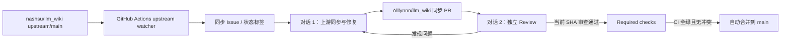

# LLM Wiki Upstream 自动更新流水线设计

## 1. 背景

当前仓库 `Alllynnn/llm_wiki` 是浏览器版本的定制 fork，官方更新来源为
`nashsu/llm_wiki`。仓库长期保留了浏览器服务、多用户登录、中文界面、问答、
共享模型配置、Embedding、Agent 检索接口和 visual-hardcase 等自定义能力。

自动更新不能简单覆盖文件。流水线必须在吸收 upstream 新功能和修复的同时，
识别并保留 fork 中已有的定制功能。

当前已有同步 PR `#1`，本地 `sync-upstream` 分支还存在未提交修改。流水线正式
启用前，先通过一次人工可见的引导运行整理当前基线，再由自动任务接管后续更新。

## 2. 目标

- 每 6 小时检测一次 `upstream/main` 是否产生了尚未进入 `origin/main` 的提交。
- 使用 PR 完成所有 upstream 合并，不直接修改 `main`。
- 使用两个职责分离的 Codex 对话完成合并修复和独立审查。
- 审查或 CI 发现问题后自动进入修复循环。
- 当前提交通过独立审查、CI 和冲突检查后自动合并。
- 保留浏览器版本已有定制，并对关键能力执行固定回归检查。
- 所有运行均可追踪、可暂停、可人工接管。

## 3. 非目标

- 不向 `nashsu/llm_wiki` 或其他上游仓库推送代码或创建 PR。
- 不使用 rebase、force push 或直接推送 `main`。
- 不让审查对话直接修改代码或批准自己产生的修改。
- 不在代码、工作流或任务提示中保存 GitHub Token、模型 Key 等密钥。
- 不自动接受无法判断是否会删除定制功能的大范围覆盖。

## 4. 总体架构

流水线由 GitHub Actions、两个持久 Codex 对话和 GitHub 合并门禁组成。两个对话
分别绑定独立 worktree，并通过每 60 分钟一次的 heartbeat 自动继续各自任务；
它们只通过 GitHub Issue、PR、标签和 commit status 交换状态。



GitHub Actions 只执行确定性的 upstream 差异检测和任务登记。Codex 只处理需要
语义判断的冲突解决、定制保留、代码修复和审查。

## 5. 组件职责

### 5.1 Upstream Watcher

新增定时 GitHub Actions workflow，每 6 小时运行一次，同时支持
`workflow_dispatch` 手动触发。

Watcher 执行以下操作：

1. 读取固定来源 `https://github.com/nashsu/llm_wiki.git` 的 `main` HEAD。
2. 判断该 SHA 是否已被 `origin/main` 包含。
3. 尚未包含时，创建或更新唯一的 upstream 同步 Issue，记录 base SHA、upstream
   SHA、提交数量和 compare 链接，并添加 `codex:sync-needed`。
4. 已包含时，关闭对应同步 Issue，不创建空 PR。

Watcher 不 checkout 或执行 upstream 中的应用代码。Actions 的 `GITHUB_TOKEN`
只授予 `contents: read`、`issues: write` 和 `pull-requests: read`。

### 5.2 对话 1：上游同步与修复

该 Codex 对话使用专属持久 worktree，并由每 60 分钟一次的 heartbeat 唤醒。
同一对话已有任务运行时不启动重叠轮次。它只处理
`codex:sync-needed` Issue 或 `codex:changes-requested` PR。

新同步流程：

1. fetch `origin` 和 `upstream`，确认远程 SHA 与 Issue 一致。
2. 从最新 `origin/main` 创建 `codex/upstream-sync-<short-sha>` 分支。
3. 执行 `git merge upstream/main`，禁止 rebase。
4. 逐文件解决冲突，同时保留 fork 定制并吸收 upstream 修复。
5. 运行本地验证，提交并以普通 push 推送分支。
6. 创建指向 `Alllynnn/llm_wiki:main` 的 PR，添加
   `automation:upstream-sync` 和 `codex:review-ready`。

修改流程：

1. 读取审查对话留下的结构化 findings 和对应 head SHA。
2. 如果远程 head 已变化，放弃本轮并重新读取，不在旧 SHA 上修改。
3. 修复问题、补充测试并运行定向验证。
4. push 前再次比较远程 head。远程已变化时停止，禁止 force push。
5. 推送成功后移除 `codex:changes-requested`，恢复 `codex:review-ready`。

### 5.3 对话 2：独立 Review

该 Codex 对话使用另一个专属持久 worktree，并由每 60 分钟一次的 heartbeat
唤醒。同一对话已有任务运行时不启动重叠轮次。它只处理带有
`automation:upstream-sync` 和 `codex:review-ready` 的 PR。

审查对话不修改应用代码。它执行以下操作：

1. 读取 PR 当前 head SHA、diff、提交记录、CI 和既有 review 记录。
2. 检查 upstream 新行为是否被正确合并，检查 fork 定制是否发生回归。
3. 运行完整验证或读取与当前 SHA 对应的 CI 结果。
4. 发现问题时，在 PR 留下包含严重度、文件位置、原因、预期修复和验证方式的
   findings；将当前 SHA 的 `codex/review` commit status 设为 `failure`，并添加
   `codex:changes-requested`。
5. 无问题时，将当前 SHA 的 `codex/review` commit status 设为 `success`，添加
   `codex:reviewed`，并为该 PR 开启 auto-merge。

审查状态绑定具体 commit SHA。执行对话推送新提交后，新 SHA 不会继承旧的
`codex/review` 成功状态，因此必须重新审查。

### 5.4 GitHub 合并门禁

`main` 启用对管理员同样生效的分支保护。合并门禁要求：

- PR 可合并且不存在未解决冲突。
- 当前 head SHA 的 `automation/gate` 状态为 `success`。
- 当前 head SHA 对应的 GitHub CI required checks 全部成功。
- PR 带有 `codex:reviewed`，且不带 `codex:changes-requested` 或
  `codex:blocked`。

新增只读取 PR 元数据、不 checkout 或执行 PR 代码的 base-branch workflow，负责
维护 required check `automation/gate`。普通 PR 直接通过该 gate；带有
`automation:upstream-sync` 的同步 PR 必须同时满足当前 head SHA 的
`codex/review=success`、标签、来源仓库和阻塞条件要求。PR 新增提交时，该 workflow
移除 `codex:reviewed`，新 SHA 在重新审查前不能通过 gate。

满足条件后使用 merge commit 自动合并。任何新提交都会产生新的 head SHA，并使
之前的 `codex/review` 和 `automation/gate` 结果失效。

同一个 GitHub 账号不能正式 approve 自己创建的 PR，因此本方案不伪造
`APPROVE`。`codex/review` commit status 是自动审查凭证；如果以后接入独立 GitHub
App 或服务账号，可以在不改变其他流程的情况下增加正式 approve。

## 6. 状态机

使用以下标签表达流水线状态：

| 标签 | 含义 |
| --- | --- |
| `codex:sync-needed` | Watcher 检测到 upstream 新提交 |
| `codex:fixing` | 执行对话正在合并或修复 |
| `automation:upstream-sync` | PR 属于 upstream 自动同步流水线 |
| `codex:review-ready` | 当前 PR head 等待独立审查 |
| `codex:changes-requested` | 审查发现问题，等待执行对话修复 |
| `codex:reviewed` | 当前 head SHA 已通过 AI 审查 |
| `codex:blocked` | 连续三轮无法解决，需要人工处理 |

正常状态流转为：

```text
sync-needed -> fixing -> review-ready -> reviewed -> merged
                              |             ^
                              v             |
                      changes-requested ----+
```

标签用于可见性和任务路由。`codex/review` 是同步 PR 的审查证据，
`automation/gate` 在当前 SHA 上核验该证据；`automation/gate` 和跨平台 CI 才是
分支保护中的 required checks。

## 7. 定制能力回归清单

每次审查至少检查以下 fork 能力是否仍可用：

- 浏览器版本服务入口和 `llm-wiki-server` 构建。
- 多用户登录、会话和项目访问控制。
- 中文界面、中文文案和“沐晨大模型知识库”品牌展示。
- 问答入口、聊天接口和页面内导航。
- 跨知识库共享的模型与 Embedding 配置。
- 自定义 Embedding endpoint 和模型配置兼容性。
- Agent Token 鉴权、检索接口和公网反向代理路径。
- visual-hardcase FAQ、新人培训、预质检和模板生成能力。
- DOCX、PDF、图片等项目资料导入和来源追踪。
- upstream 新增的 Agent、Skill、历史、导入和检索功能。

PR 描述必须包含这份清单的本轮检查结果，不能只写“保留定制”。

## 8. 验证策略

执行对话在 push 前运行与改动相关的定向测试，并至少运行：

```powershell
npm run typecheck
npm run test:mocks
npm run build
npm --prefix mcp-server test
npm run mcp:build
```

涉及 Rust 或服务端代码时运行：

```powershell
cargo build --manifest-path src-tauri/Cargo.toml --bin llm-wiki-server
cargo test --manifest-path src-tauri/Cargo.toml --lib --bin llm-wiki-server
```

GitHub CI 使用锁文件安装依赖，并在 Windows、Linux 和 macOS 上执行：

- `npm ci`
- `npm run build`
- `npm run test:mocks`
- MCP Server 安装、构建和测试
- `cargo build --bin llm-wiki-server`
- `cargo test --lib --bin llm-wiki-server`

当前 CI 中的 `npx vite build` 不包含 TypeScript 类型检查，实施时改为
`npm run build`。

## 9. 故障处理

- 网络、GitHub API 或 upstream fetch 临时失败：不改变状态，下一轮重试。
- CI 基础设施偶发失败：重跑一次；再次失败后进入修复流程。
- 代码或测试失败：添加 `codex:changes-requested`，由执行对话修复。
- push 被拒绝：说明远程 head 已变化；重新 fetch，禁止 force push。
- upstream 历史异常或无法建立可靠 merge base：添加 `codex:blocked`，停止合并。
- 同一问题连续三轮未解决：添加 `codex:blocked`，在 PR 中报告失败命令、冲突文件、
  已尝试方案和需要人工决定的事项。
- 找不到待处理 Issue 或 PR：本轮正常结束，不创建无意义提交或评论。

`codex:blocked` 存在时，Watcher 可以继续更新 upstream SHA，但执行对话和 auto-merge
不得越过阻塞状态。

## 10. 首次启用

首次启用不新建重复同步 PR，而是接管现有 PR `#1`：

1. 盘点当前 `sync-upstream` 工作区修改。
2. 排除 `.tmp`、`tmp`、缓存、日志、构建产物和其他临时文件。
3. 对其余修改按功能归类，建立可追踪的安全基线提交并推送到现有分支。
4. 将最新 `upstream/main` 合入 PR `#1`，逐文件解决冲突。
5. 将 Watcher、CI 门禁和自动任务所需元数据一起加入 PR。
6. 更新 PR 标题和描述，使其准确反映目标 upstream SHA 和定制回归结果。
7. 由独立审查对话执行首次 review。
8. 当前 SHA 的审查和 CI 全部通过后自动合并 PR `#1`。
9. PR `#1` 合并后，定时 Watcher 和两个 Codex 自动任务进入常态运行。

由于 `automation/gate` workflow 在合并前尚未存在于默认分支，PR `#1` 使用一次性
引导门禁：当前 SHA 的 `codex/review`、现有跨平台 CI 和无冲突检查必须通过后才
启用 auto-merge。PR `#1` 合并后立即启用 `automation/gate` required check 和对
管理员同样生效的完整分支保护；之后不再使用引导例外。

首次基线提交不包含未经盘点的临时目录，也不整段覆盖存在 fork 定制的冲突文件。

## 11. 安全边界

- 自动任务只能向 `Alllynnn/llm_wiki` 推送同步分支。
- 自动任务不能向 `nashsu/llm_wiki` 或 GitHub 显示的其他 parent fork 推送。
- 禁止 rebase、force push、直接 push `main`、删除本地功能和跳过失败检查。
- Actions 使用最小权限；本地任务复用系统已有 GitHub 登录，不输出 token。
- PR head SHA 在 review、修复、push 和合并前都必须重新读取。
- 不运行来源不明的 PR；流水线只处理带固定标签且 head repo 为
  `Alllynnn/llm_wiki` 的同步 PR。

## 12. 可观测性与人工控制

- 同步 Issue 记录 upstream SHA、检测时间和 compare 链接。
- PR 评论记录每轮执行的 head SHA、冲突、修改、测试和 review 结果。
- Codex 自动任务无工作时保持安静，不产生重复评论。
- 移除 `codex:review-ready` 或添加 `codex:blocked` 可以暂停处理。
- 关闭同步 Issue 可以取消当前同步请求，但不会删除分支或改写历史。
- 支持手动触发 Watcher，便于发布新版本后立即检查。

## 13. 验收标准

- Watcher 能识别尚未进入 fork 的 upstream SHA，并只维护一个同步任务。
- 执行对话能在独立 worktree 中创建或更新同步 PR，不污染当前工作目录。
- 审查对话不会修改应用代码，能够对当前 head SHA 发布明确的成功或失败状态。
- 推送新提交后，旧 SHA 的审查成功不能使新 SHA 被自动合并。
- 任一 required check 失败、`automation/gate` 未成功、存在冲突或存在
  `codex:blocked` 时不能自动合并。
- 所有门禁通过后，PR 自动合并到 `Alllynnn/llm_wiki:main`。
- 浏览器版关键定制和 upstream 新功能均有可追踪的检查结果。
- 整个流程不向上游仓库写入、不 force push、不直接修改 `main`。
